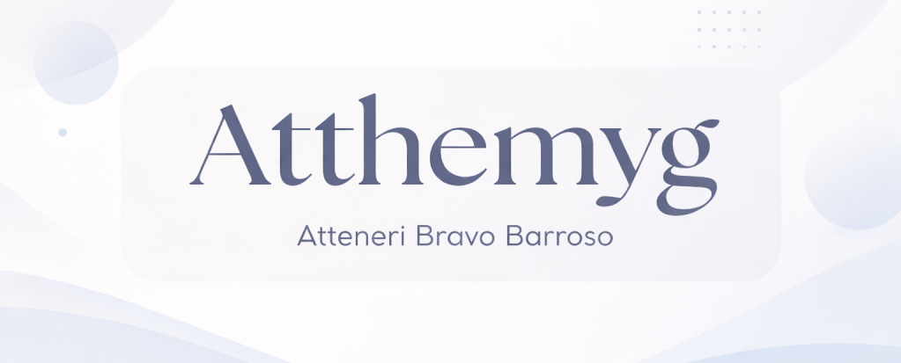

<h1 align="center">🌸 Welcome to my profile! 🌸</h1>

# About me 👩‍💻

💻 **Multiplatform Application Development student (DAM)**

🎓 **B1 and B2 Cambridge English Titles**

📍 **Studying in: IES Telesforo Bravo (2025-2026)**

I'm Atteneri, a DAM student motivated by learning and continuously improving my programming skills. I like to transform ideas into functional applications, working on both logic and design.

In my free time I love to play videogames, read, draw, and watch series and movies, activities that help me develop my creative side and disconnect. I also enjoy travelling and discovering new places, as it provides me with new experiences. Besides, I usually listen to music while I program or study to concentrate and stay motivated.

# Technologies ⌨️

- **I'm learning to use:**

 

 
 

- **Other technologies I'm familiar with:**

<!--
**Atthemyg/Atthemyg** is a ✨ _special_ ✨ repository because its `README.md` (this file) appears on your GitHub profile.

Here are some ideas to get you started:

- 🔭 I’m currently working on ...
- 🌱 I’m currently learning ...
- 👯 I’m looking to collaborate on ...
- 🤔 I’m looking for help with ...
- 💬 Ask me about ...
- 📫 How to reach me: ...
- 😄 Pronouns: ...
- ⚡ Fun fact: ...
-->
