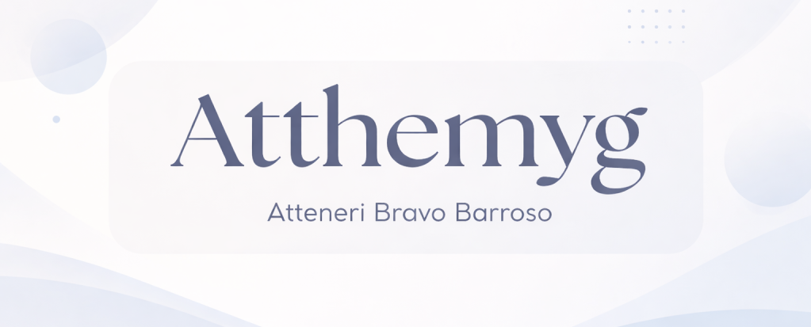

<!--<h1 align="center">🌸 Welcome to my profile! 🌸</h1>-->

# About me 👩‍💻

💻 **Multiplatform Application Development student (DAM)**

🎓 **B1 and B2 Cambridge English Titles**

🚀 **Interest in Full Stack Development**

📱 **Android Development with Java**

⚙️ **REST APIs with Java/Spring**

🌍 **Experience with agile methodologies**

 

I'm Atteneri, a DAM student motivated by learning and continuously improving my programming skills. I like to transform ideas into functional applications, working on both logic and design.

On my free time I love to play videogames, read, draw, listen to music and watch series and movies, activities that help me develop my creative side and disconnect. I also enjoy travelling and discovering new places, as it provides me with new experiences.

 

**🧼 Clean Code • 🌱 Open Source • ❤️ Tech Lover**

 

# Technologies ⌨️

- ### I'm learning to use:

<!--

-->

- ### About other things I'm familiar with:
  

 

# Agile methodologies 🧩

 

  
  
  

<!--
## ⭐ Proyectos Destacados

<table>
<tr>

<td width="33%" align="center">

### 📱 App Android  
Java · Android Studio  

Aplicación móvil desarrollada en Android para gestión de tareas.

➡️ [Ver repositorio](https://github.com/juanespana/PROYECTO_ANDROID)

</td>

<td width="33%" align="center">

### 🔗 API REST  
Java · Spring · Maven  

Backend REST para gestión de datos y servicios.

➡️ [Ver repositorio](https://github.com/juanespana/API_REST)

</td>

<td width="33%" align="center">

### 📊 Dashboard Web  
React / Web  

Panel interactivo de visualización de datos.

➡️ [Ver repositorio](https://github.com/juanespana/DASHBOARD)

</td>

</tr>
</table>
-->
 

# My goal ✨

My goal is to continue learning to improve my technical skills and participate in projects that allow me to gain experience to grow professionally.

 

> The only way to learn is to live.
> — The Midnight Library

 

# Contact me 🌐

 

<table align="center">
  <tr>
    <td align="center">
      
    </td>
    <td>
      atthemyg@gmail.com
    </td>
  </tr>
  <tr>
    <td align="center">
      
    </td>
    <td>
      www.linkedin.com/in/atthemyg
    </td>
  </tr>
  <tr>
    <td align="center">
      
    </td>
    <td>
      https://github.com/Atthemyg
    </td>
  </tr>
  <tr>
    <td align="center">
      
    </td>
    <td>
      https://t.me/Atthemyg
    </td>
  </tr>
</table>

 

<em>Profile in constant learning and improvement 🚀</em>

<!--[My proyects](img_header/Proyects.png)-->

<!--
**Atthemyg/Atthemyg** is a ✨ _special_ ✨ repository because its `README.md` (this file) appears on your GitHub profile.

Here are some ideas to get you started:

- 🔭 I’m currently working on ...
- 🌱 I’m currently learning ...
- 👯 I’m looking to collaborate on ...
- 🤔 I’m looking for help with ...
- 💬 Ask me about ...
- 📫 How to reach me: ...
- 😄 Pronouns: ...
- ⚡ Fun fact: ...
-->
